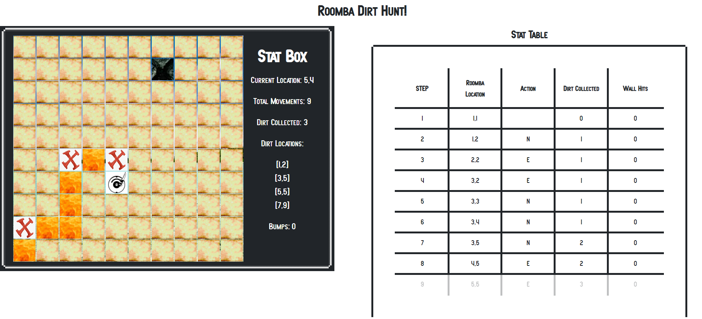
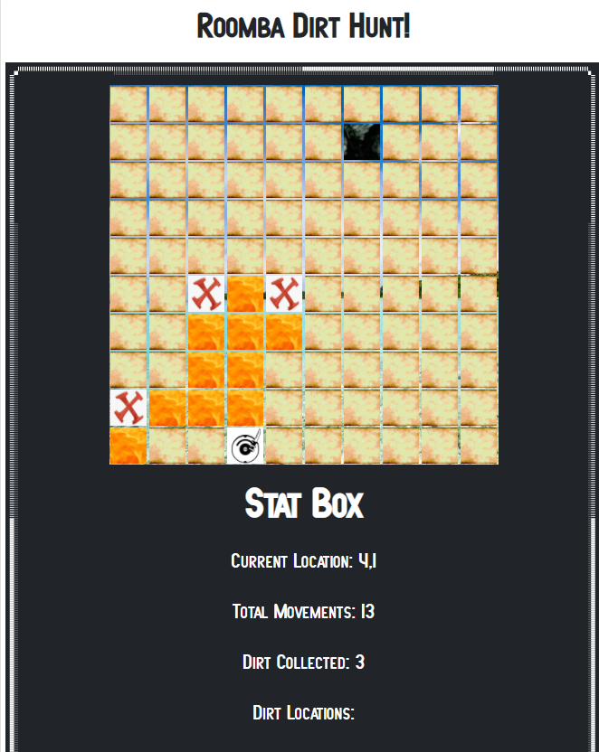
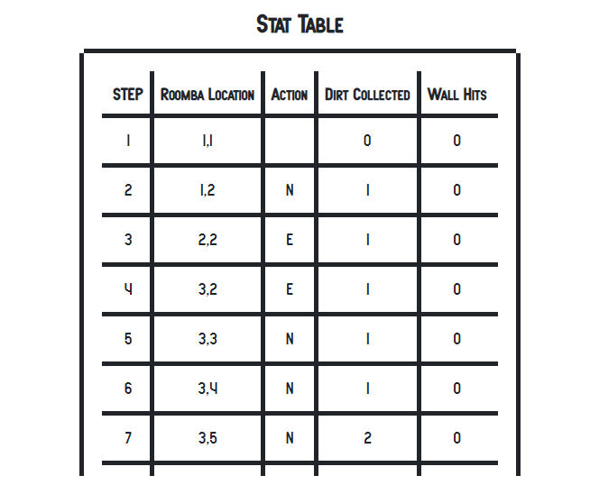

<!-- # book-thing.io

Initial wireframes:

https://wireframe.cc/x0a8I9

https://wireframe.cc/6oVXTU -->
# Roomba Dirt Hunt!

A web-application that shows the valiant efforts of a cute knife-wielding roomba in search of dirt on a grid. During development, arrow controls were implemented to create a game application. Further iterations on this concept will be implemented to create a game complete with leader boards and enhanced graphics.

## Motivation

I was given a challenge to create a grid that contained dirt piles on certain squares. Then I was asked to give a set of directions for the roomba to execute on auto-pilot. During its journey, I was to update its status and progress. A stat-box displays general information, and a stat-table displays the results of each turn.


## Screenshots

Full Screen: 

Mobile Map: 

Mobile Stat-Table 


## Environment Setup

1. You'll need to clone <INSERT LINK> and run 
```
npm install
```
then
```
npm start
```

2. Do the same for this package.

3. Open up a window at localhost:3000


## Running the tests

To run all tests, run
```
npm test
```

## Built With

### Front-End
* React

### Testing
* Jest
* Enzyme

## Features

* Create a list of characters
* See comic book series belonging to the characters you've chosen
* Use links to potentially buy series you're interested in

## Running Project Link

- [Live](https://infinite-journey-91193.herokuapp.com/)

## Authors

* **Adrian Rosales** - ** - Fullstack Web Development


## Acknowledgments

* **Starline** - ** - For the use of their art for the 'Search' page.
- [Art](https://www.freepik.com/free-photos-vectors/background")